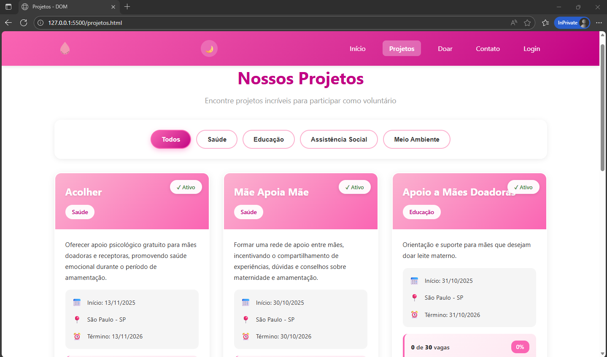
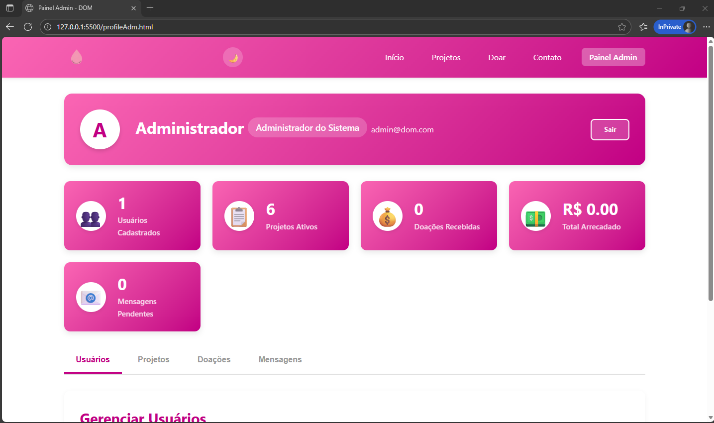
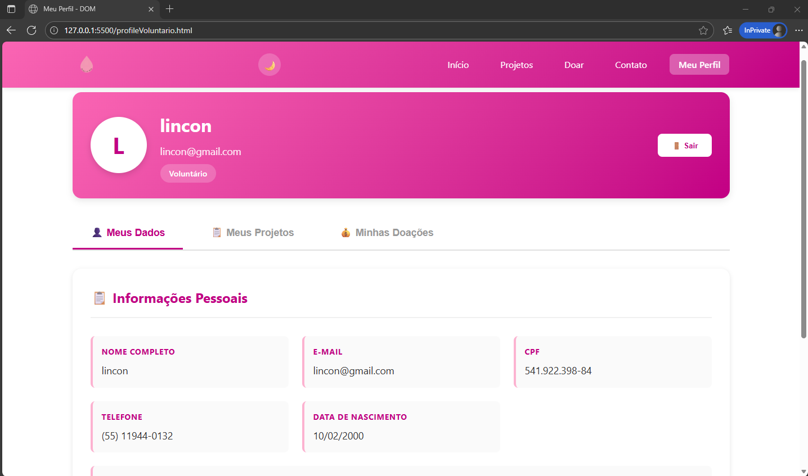
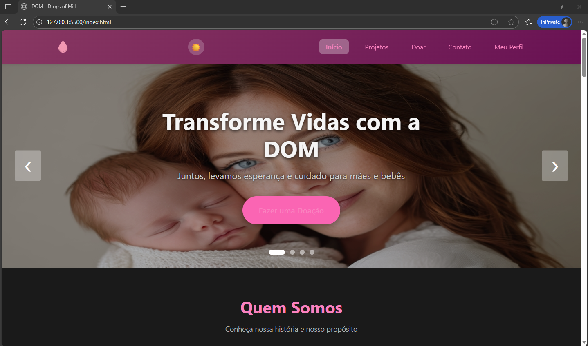

# 🩷 DOM - Drops Of Milk

> Plataforma digital de gestão de banco de leite humano, conectando doadores, voluntários e beneficiários.

---

## 📋 Índice

- [Sobre o Projeto](#sobre-o-projeto)
- [Funcionalidades](#funcionalidades)
- [Tecnologias Utilizadas](#tecnologias-utilizadas)
- [Estrutura do Projeto](#estrutura-do-projeto)
- [Como Executar](#como-executar)
- [Usuários de Teste](#usuários-de-teste)
- [Capturas de Tela](#capturas-de-tela)
- [Contribuidores](#contribuidores)
- [Licença](#licença)

---

## 🎯 Sobre o Projeto

A **DOM** é uma ONG dedicada à promoção da saúde infantil através da doação de leite materno. Este projeto consiste em uma plataforma web completa para:

- 📊 Gerenciar projetos e voluntários
- 💝 Facilitar doações e inscrições
- 👥 Conectar mães doadoras com famílias beneficiadas
- 📈 Acompanhar impacto social em tempo real

### Objetivos

- ✅ Digitalizar processos de gestão da ONG
- ✅ Aumentar visibilidade dos projetos sociais
- ✅ Facilitar cadastro de voluntários
- ✅ Promover transparência nas doações
- ✅ Fortalecer rede de apoio materno-infantil

---

## ⚙️ Funcionalidades

### 🌐 Para Visitantes (Público Geral)

- ✅ Visualizar projetos ativos
- ✅ Conhecer a história e equipe da DOM
- ✅ Entender benefícios do aleitamento materno
- ✅ Acessar informações de contato
- ✅ Alternar entre tema claro/escuro

### 👤 Para Voluntários (Usuários Autenticados)

- ✅ Fazer login/cadastro
- ✅ Inscrever-se em projetos
- ✅ Acompanhar histórico de participação
- ✅ Visualizar doações realizadas
- ✅ Gerenciar perfil pessoal

### 👨‍💼 Para Administradores

- ✅ Dashboard com estatísticas
- ✅ Gerenciar usuários (CRUD completo)
- ✅ Criar/editar/excluir projetos
- ✅ Visualizar mensagens de contato
- ✅ Aprovar inscrições de voluntários
- ✅ Gerar relatórios de impacto

---

## 🛠️ Tecnologias Utilizadas

### Frontend

- **HTML5** - Estrutura semântica
- **CSS3** - Estilização moderna com CSS Grid/Flexbox
- **JavaScript (Vanilla)** - Interatividade e manipulação do DOM
- **Bootstrap 5.3** - Componentes responsivos

### Armazenamento

- **LocalStorage** - Persistência de dados no navegador

### Bibliotecas/Recursos

- **Font Awesome** - Ícones (opcional)
- **Google Fonts** - Tipografia personalizada

---

## 📁 Estrutura do Projeto

```
ONG-DOM-final/
│
├── index.html                 # Página inicial
├── cadastro.html              # Tela de cadastro
├── doacoes.html               # Tela de Doações
├── contato.html               # Tela de contato para Visitantes/Empresas
├── projetos.html              # Lista de projetos
├── contato.html               # Formulário de contato
├── login.html                 # Tela de login
├── profileVoluntario.html     # Perfil do voluntário
├── profileAdm.html            # Painel administrativo
│
├── css/
│   ├── global.css             # Estilos globais + tema escuro
│   ├── index.css              # Estilos da home
│   ├── projetos.css           # Estilos de projetos
│   ├── contato.css            # Estilos de contato
│   ├── login.css              # Estilos de login
|   ├── doacoes.css            # Estilos de Doar
|   ├── auth.css               # Estilos de Autenticações
│   ├── profile.css            # Estilos do perfil voluntário
│   └── profile-admin.css      # Estilos do painel admin
│
├── js/
│   ├── auth.js                # Sistema de autenticação
│   ├── global.js              # Funções globais (menu, tema)
│   ├── projetos.js            # Gestão de projetos
│   ├── carousel.js            # Carrossel da home
│   ├── index-page.js          # Lógica da página inicial
│   ├── profile-voluntario.js  # Lógica do perfil voluntário
│   └── profile-admin.js       # Lógica do painel admin
│
├── assets/
│   └── images/                # Imagens do projeto
│       ├── Logo_final.png
│       ├── img_*.jpeg         # Banners
│       └── team/              # Fotos da equipe
│
└── README.md                  # Documentação do projeto
```

---

## 🚀 Como Executar

### Link direto do site: https://monicannk.github.io/Ong_DOM/

### Pré-requisitos

- Navegador web moderno (Chrome, Firefox, Edge)
- Editor de código (VS Code recomendado)
- Extensão Live Server (opcional, para desenvolvimento)

### Passo a Passo

1. **Clone o repositório**

```bash
git clone https://github.com/seu-usuario/ong-dom.git
cd ong-dom
```

2. **Abra o projeto**

- **Opção 1 (Recomendada):** Usando Live Server
  - Clique com botão direito em `index.html`
  - Selecione "Open with Live Server"

- **Opção 2:** Diretamente no navegador
  - Dê duplo clique em `index.html`
  - URL: `file:///caminho/para/index.html`

3. **Acesse o sistema**

- Página inicial: `http://127.0.0.1:5500/index.html`
- Login: `http://127.0.0.1:5500/login.html`

---

## 🔑 Usuários de Teste

### Administrador

```
E-mail: admin@dom.com
Senha: admin123
```

**Permissões:**
- Gerenciar usuários
- Criar/editar projetos
- Visualizar mensagens
- Acessar dashboard completo

### Voluntário

```
Realizar criação de usuário na tela de cadastro e acessar sistema.
```

**Permissões:**
- Inscrever-se em projetos
- Visualizar histórico
- Editar perfil pessoal

---

## 📸 Capturas de Tela

### Página Inicial


### Projetos


### Painel Admin


### Perfil Voluntário


### Tema Escuro


---

## ✨ Funcionalidades Detalhadas

### Sistema de Autenticação

- ✅ Registro de novos usuários
- ✅ Login com validação
- ✅ Logout seguro
- ✅ Persistência de sessão
- ✅ Validação de e-mail único

### Gestão de Projetos

- ✅ Listagem com filtros (categoria, status)
- ✅ Visualização detalhada
- ✅ Sistema de vagas (limitadas)
- ✅ Inscrição de voluntários
- ✅ Barra de progresso de inscrições

### Perfil do Voluntário

- ✅ Edição de dados pessoais
- ✅ Histórico de inscrições
- ✅ Doações realizadas
- ✅ Mensagens enviadas

### Painel Administrativo

- ✅ Dashboard com métricas
- ✅ Gerenciamento de usuários
- ✅ CRUD de projetos
- ✅ Visualização de mensagens
- ✅ Sistema de abas organizado

### Tema Claro/Escuro

- ✅ Alternância suave
- ✅ Persistência da preferência
- ✅ Suporte em todas as páginas
- ✅ Contraste adequado (WCAG)

---

## 🎨 Design

### Paleta de Cores

```css
/* Tema Claro */
--rosa-claro: #ffb3d0;
--rosa-medio: #ff69b4;
--rosa-escuro: #c71585;
--cinza-claro: #f5f5f5;
--cinza-escuro: #333;

/* Tema Escuro */
--bg-principal: #1a1a1a;
--bg-secundario: #2a2a2a;
--destaque: #ff85c0;
--texto-principal: #d0d0d0;
```

### Responsividade

- 📱 **Mobile:** 320px - 768px
- 💻 **Tablet:** 769px - 1024px
- 🖥️ **Desktop:** 1025px+

---

## 🐛 Problemas Conhecidos

- [ ] Mensagens de contato não enviam e-mail real (usa LocalStorage)
- [ ] Sistema de pagamento é simulado
- [ ] Sem backend (dados não persistem entre dispositivos)
- [ ] Upload de imagens usa URLs estáticas

---

## 🔮 Melhorias Futuras

- [ ] Integração com backend (Node.js + MongoDB)
- [ ] Sistema de notificações
- [ ] Chat em tempo real
- [ ] Gateway de pagamento real
- [ ] Upload de imagens
- [ ] Exportação de relatórios (PDF)
- [ ] PWA (Progressive Web App)
- [ ] Integração com API de e-mail

---

## 👥 Contribuidores

Este projeto foi desenvolvido por:

- **Lincon** - Desenvolvedor Full Stack
- **Mônica** - Desenvolvedora Full Stack
- **Marcio** - Desenvolvedor Full Stack
- **Equipe DOM** - Requisitos e validação

---

## 📄 Licença

Este projeto está sob a licença MIT. Veja o arquivo [LICENSE](LICENSE) para mais detalhes.

---

## 📞 Contato

**DOM - Drops Of Milk**

- 🌐 Website: [www.dom.org.br]([https://www.dom.org.br](https://monicannk.github.io/Ong_DOM/))
- 📧 E-mail: contato@dom.org.br
- 📱 Telefone: (11) 1234-5678
- 📍 Endereço: São Paulo - SP, Brasil

---

## 🙏 Agradecimentos

- Rede Brasileira de Bancos de Leite Humano (rBLH)
- Organização Mundial da Saúde (OMS)
- Comunidade de desenvolvedores open source
- Mães doadoras e voluntários

---

## 🌟 Apoie o Projeto

Se você gostou deste projeto:

- ⭐ Deixe uma estrela no GitHub
- 🍴 Faça um fork
- 🐛 Reporte bugs
- 💡 Sugira melhorias

---

**Feito com 💗 pela DOM**

*"Cada gota de leite representa vida e esperança"*
